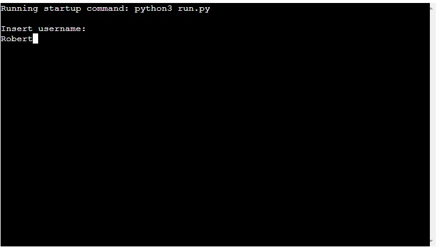
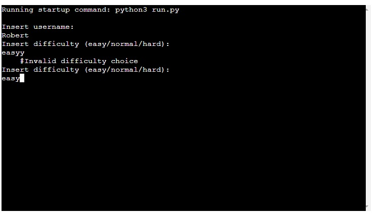
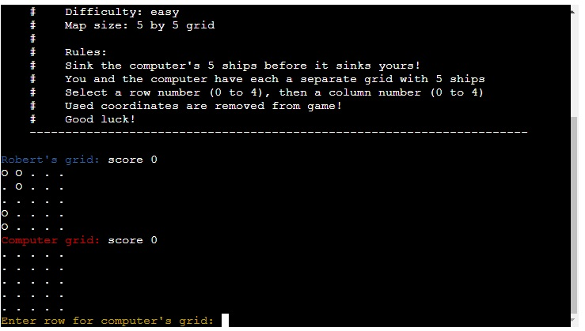
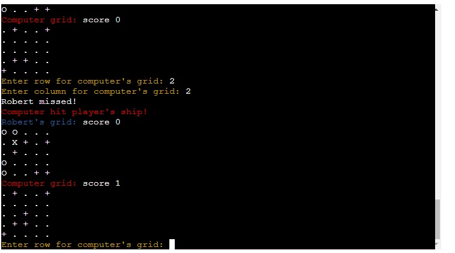
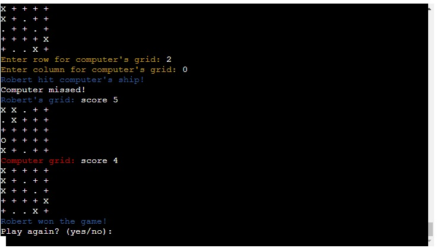
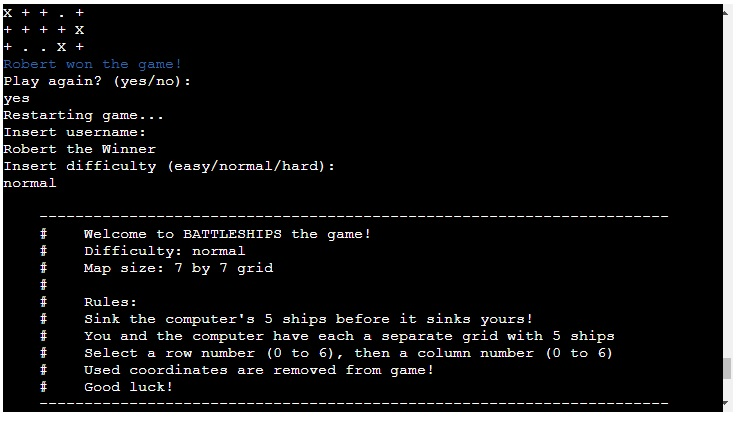
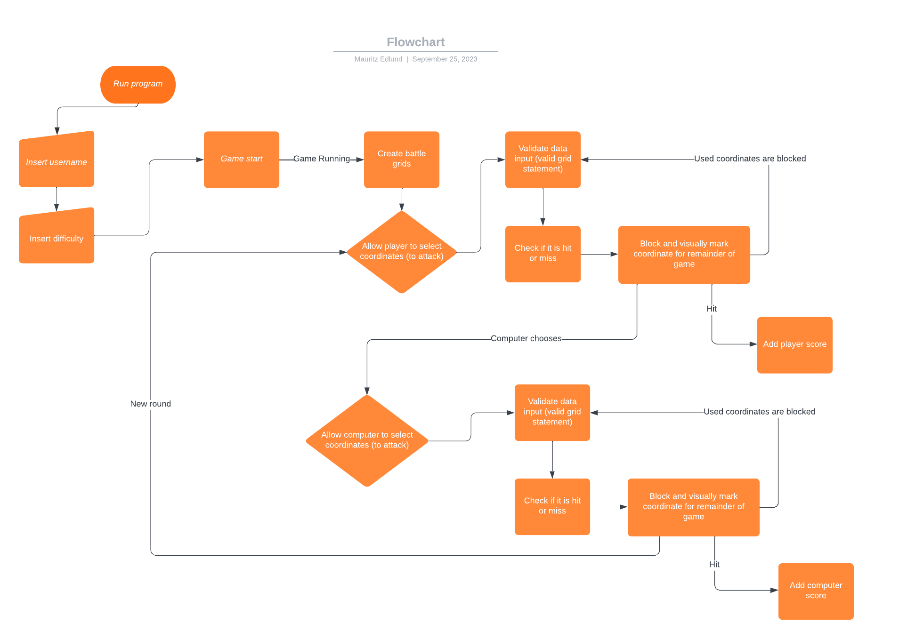
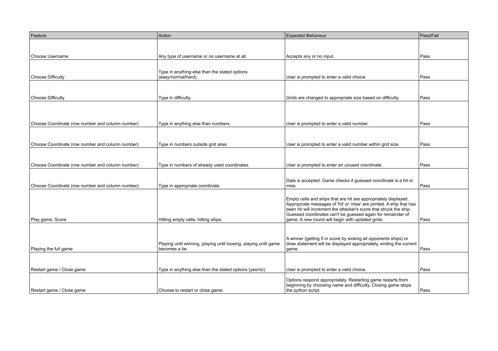
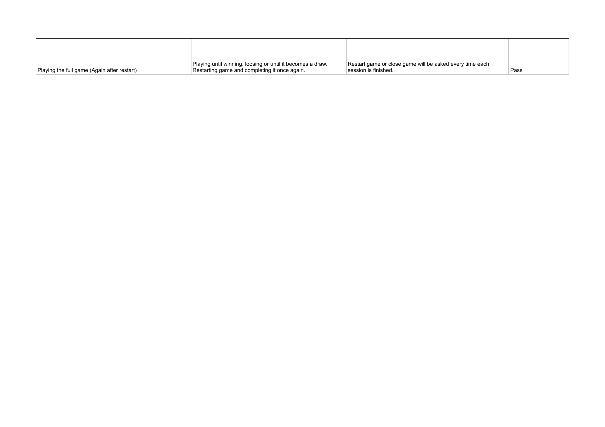
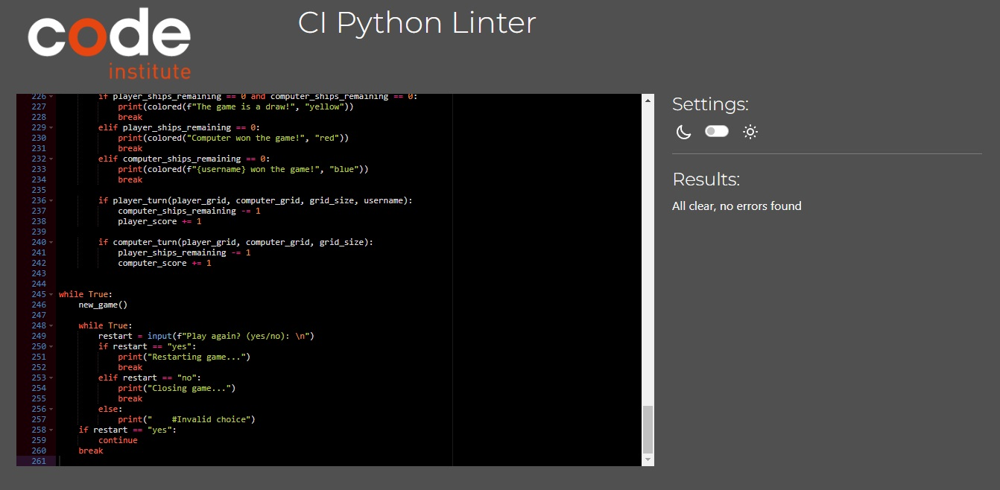

[View the site live here!](https://battleships-python-game-4a6d011d8d48.herokuapp.com/)

# Battleships

Battleships is a Python terminal game.

Users will attempt to beat the computer by eliminating its 5 ships before it finds and sinks the user's own 5 ships.
Each ship occupies one cell on the grid.

## How to play

Battleships is based on the classic pen-and-paper game. More information can be seen here https://en.wikipedia.org/wiki/Battleship_(game)

In this game, the user will enter their name and then choose a difficulty.
The difficulty is fixed to three modes: easy, normal and hard.
  - Easy will create a 5 by 5 grid (making a 'map' of 25 cells)
  - Normal creates a 7 by 7 grid (49 cells)
  - Hard creates a 10 by 10 grid (100 cells)

After the user's name has been entered and the difficulty has been selected, a grid will be made for both the player and the computer.
5 ships will randomly be placed on each corresponding grid.
A ship is marked as an 'O' and will be marked 'X' if it is hit, and an empty cell is marked as '.' and will be marked '+' if it is hit.
A guessed coordinate cannot be guessed again.

The computer's ships on its grid are hidden.

The winner is declared once they sink all their opponents ships.

## Features

### Existing Features

- **Username**

  - The user is prompted to enter their username, which will be displayed in the game.

- **Difficulty**

  - The user is prompted to select one of three difficulties (easy, normal or hard). This will decide the size of the user's and computer's grids.
  - Easy will create a 5 by 5 grid (making a 'map' of 25 cells)
  - Normal creates a 7 by 7 grid (49 cells)
  - Hard creates a 10 by 10 grid (100 cells)

- **Ship randomization**

  - 5 ships are randomly placed on each corresponding grid once the difficulty (which determines the grid size) has been chosen.
  - The ships on computer's grid are hidden from player.

- **Score**

  - Displayed above the grids and to the right of the computer's and user's names. It keeps track of how many ships have been eliminated by each competitor.

- **Winner and Restart**

  - A winner will be declared at the end of the game.
  - The user can choose whether to restart the game or close it.

### Features Left to Implement

- Allow player to select placement of ships.
  - **Reasons**: Lack of time.

- Allow selection of amount of ships.
  - **Reasons**: Lack of time.

- Have larger ships than single cell ships.
  - **Reasons**: Lack of time.

- Computer Commenting.
  - Make the computer do reactive comments on how the game is going by having a list of commentaries it can pull from a google spreadsheet (or equal).
  - **Reasons**: Lack of time.

## Design

- **Flowchart**

  - The initial game page flowchart.
    

- **Flowchart / End Design Likeness**

  - Game page

    - Flowchart contain the basic ideas of the game.
    - Flowchart are missing 'restart game' and 'close game' functions. Flowchart is missing winning conditions.
      - **Reasons**: Coding for the Python game began when sufficient basics in the flowchart were established.

- **Colours**

  - There are 3 colours in the game. The user is presented with blue colour while the computer is presented with red. The input for typing in coordinates for the user is marked with yellow text. If the game turns out to be a draw, this text will also be in yellow colour.
  - Texts marked with colours are: competitors' names above their grids, messages when hitting enemy ships (example: 'Computer hit player's ship!' is marked with red), when winning a game (example: '(Username) won the game!' is marked with blue), if the game becomes a draw (marked with yellow), and when typing in coordinates for user (yellow).
    - **Reasons**: Better UX. Makes the game more visually pleasing and easier to distinguish between user and computer. It also clarifies the 'action' inputs by the user. 

## Testing

### Manual Testing

### Validator Testing

- Python
  - No errors or warnings were found when passing through the PEP8 python validator: <https://pep8ci.herokuapp.com/>

- PEP8 validator result for run.py

  

### Media

- Tested on Microsoft Edge, Mozilla Firefox and Chrome.
- Screen media mockup tested on <https://ui.dev/amiresponsive?url=https://battleships-python-game-4a6d011d8d48.herokuapp.com/>
- Tested on desktop, laptop and mobile.

### Fixed Bugs

- Failed to upload requirements for heroku. ('pip3 freeze > requirements.txt' in terminal generated requirements that couldn't be deployed)
  - Bug was fixed by removing all generated requirements except 'termcolor==2.3.0' that was installed to display colours in the terminal.
  - **Reasons**: Root cause stems from the template. The template should've been https://github.com/Code-Institute-Org/p3-template, however the template that was used was https://github.com/Code-Institute-Org/python-essentials-template.

- Entering 'yes' in 'Play again? (yes/no):' resulted in the same input message being returned, without actually restarting game.
  - Bug was fixed by properly breaking and continuing in correct order inside the while loops.

- If the user and computer sinks each other's last ship at the same turn (thus ending the game), the game tells that the computer is the winner. This shouldn't be the case as it should be a draw.
  - Bug was easily fixed by placing an if statement at the top of the other winning condition statements: which checks if both the user **and** computer doesn't have any ships left, then 'The game is a draw!'.

### Unfixed Bugs

- There are no known unfixed bugs.

## Deployment

- The site was deployed using Code Institute's mock terminal for Heroku:
  - Create a new Heroku app.
  - Add config var with key: 'PORT' and value: '8000'.
  - Go to settings and set buildpacks to Python and NodeJS, in that order.
  - Go to deploy, select deployment method (GitHub).
  - Search for 'battleships' in app to connect to GitHub and connect the repository to Heroku.
  - Hit 'deploy branch' at bottom of page.
  - Select 'Open app' at the top of the page.

Link to live site - <https://battleships-python-game-4a6d011d8d48.herokuapp.com/>

- Cloning the Repository:
  - On the repository page, click the 'Code' box.
  - Pick local then HTTPS and copy the link that is shown, which is: <https://github.com/Masorr/battleships.git>
  - Open the terminal in your code editor and specify the directory you want to have your clone.
  - Type 'git clone' into your terminal and paste the link <https://github.com/Masorr/battleships.git> and hit enter.

## Credits

### Content

- Python structuring and understanding of concepts was made with the help by the course material from Code Institute and was heavily inspired by the ULTIMATE Battleships project.
- Print statement for several rows comes from https://stackoverflow.com/questions/34980251/how-to-print-multiple-lines-of-text-with-python
- Term color comes from https://www.studytonight.com/python-howtos/how-to-print-colored-text-in-python
- Idea for making a list of lists with list comprehension for eventually making grids comes from https://stackoverflow.com/questions/21507319/list-comprehension-list-of-lists
- Idea for hiding ships comes from https://stackoverflow.com/questions/70220471/how-to-hide-value-in-array-for-battleship-game

## Thanks

- I want to thank Code Institute and their tutors for their program and lessons, and giving me the opportunity to navigate and learn by myself by coding this terminal game in Python.
- I want to thank the Slack community and my mentor Dick Vlaanderen for feedback and inputs.